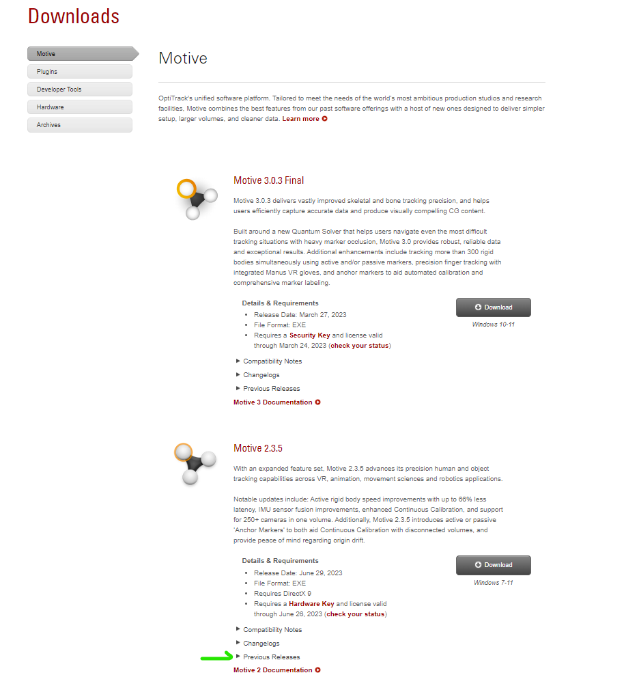
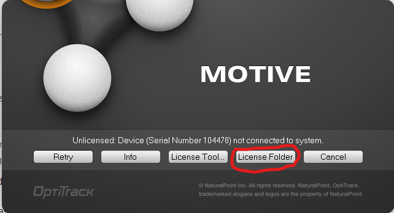
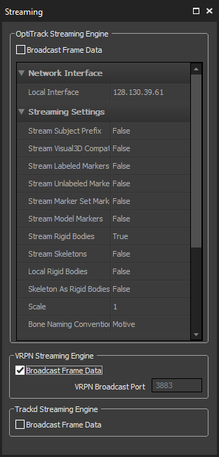

# Server setup guidance
OptiTrack Motive VRPN Streaming Setup and Configure Guidance.

## Motive installation
1. Go to the [Optitrack website](https://optitrack.com/support/downloads/motive.html) and find Motive 1.7.5 by clicking on the place shown in the screenshot below, and install it.

2. After installation, run Motive, and click on `license folder` as shown below. The license folder will then pop up.

3. Copy the attached license file into the license folder.
  
4. Plug in the hardware key and click on `Retry`. 

## VRPN server configure in Motive
Go to `View -> Data Streaming`. Scroll down and find `VRPN Streaming Engine`, tick on `Broadcast Frame Data`, then the data should be streaming.

Note that currently only `rigid body` data is streamed, make sure rigid bodies are created. 
