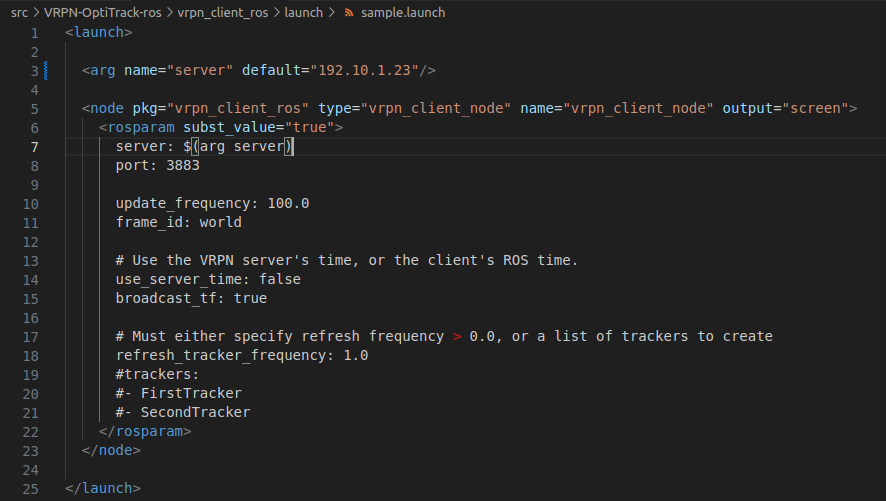

# vrpn-client-ros
A guide for setting up the VRPN client in ROS for receiving data from the Optitrack.

# OptiTrack Server Setup
Please refer to [OptiTrack Motive VRPN Streaming Setup and Configure Guidance](Optitrack_server_setup.md).

# VRPN ROS Client Setup
The Virtual-Reality Peripheral Network (VRPN) is a set of classes within a library and a set of servers that are designed to implement a network-transparent interface between application programs and the set of physical devices (tracker, etc.) used in a virtual-reality (VR) system. In this repo, we'll only focus on the Optitrack device.

## Submodule in this repo
This repo contains the following submodules which are comprehensive to read the data from OptiTrack.

[vrpn_client_ros](https://github.com/Murphy41/vrpn_client_ros)

[vrpn_catkin](https://github.com/ethz-asl/vrpn_catkin)

[catkin_simple](https://github.com/catkin/catkin_simple)

## Installation
In the `src` folder in your workspace run the following command:

    git clone --recurse-submodules https://github.com/Murphy41/VRPN-OptiTrack-ros.git

Pleaes note that this repo contains submodules and you need to use `--recurse-submodules` to clone them all.

Then, navigate back to the workspace root path to build it. This step is similar to all other ros packages. In this step, a known bug that a file is missing will interrupt the catkin_make process. To resolve it, you can do `catkin_make` twice, as the first make process could generate the missing file automatically. However, to avoid this doggy process, it is suggested to use `catkin build` rather than `catkin_make`, and this more intellegent catkin tool could handle the build priority in the process. To install `catkin build` or other catkin tools, please check their [tutorials](https://catkin-tools.readthedocs.io/en/latest/installing.html).

## Configuration

A [sample launch file](https://github.com/Murphy41/vrpn_client_ros/blob/noetic-devel/launch/sample.launch) is given in VRPN-OptiTrack-ros/vrpn_client_ros/launch folder. As shown in the image, the rosparam in it can be configured based on your needs. In the common case, to run this sample, just check the server ip address and port in the launch file. You can either change the default ip in the launch file directly or state it when use roslaunch (as shown in the following [section](#test)).

## Test

To test the sample launch file, simply use the following code, and replace the following ip address with the ip address of your OptiTrack server.

    roslaunch vrpn_client_ros sample.launch server:=128.130.39.61 & rosrun rviz rviz

The running screenshot will be put here later.

# Acknowledgement
The vrpn_client_ros noetic version is forked from [usrl-uofsc/vrpn_client_ros](https://github.com/usrl-uofsc/vrpn_client_ros) which is developed based on [ros-drivers/vrpn_client_ros](https://github.com/ros-drivers/vrpn_client_ros)
